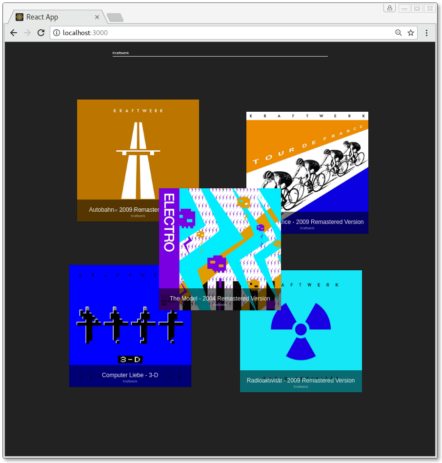

# LauchSpot

> Beautiful Spotify-Explorer on React!



## Setup

```bash
cd createreactapp
npm install
```

## Start

```bash
npm start
google-chrome --user-data-dir --disable-web-security
```
`http:\\localhost:3000`